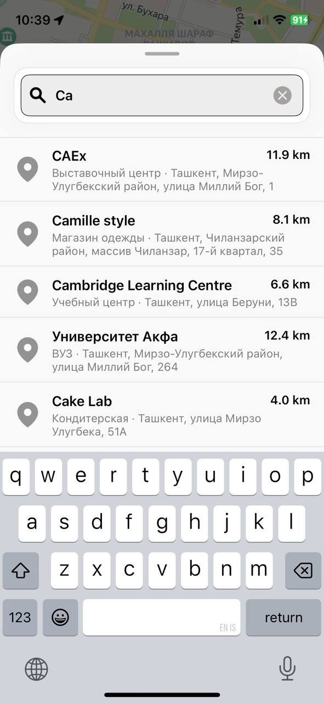

# Find_All

Find_All — bu iOS platformasi uchun ishlab chiqilgan xarita asosidagi mobil ilova bo‘lib, foydalanuvchilarga o‘z joylashuvlarini aniqlash, YandexMaps orqali izlash va tanlangan manzillarni saqlash imkonini beradi.

## 📱 Asosiy imkoniyatlar

- YandexMaps integratsiyasi
- Draggable pin bilan real vaqt manzil aniqlash
- SnapKit orqali custom UI
- Modal search va dynamic suggest list
- Manzillar ro‘yxatini saqlash
- MVVM arxitektura asosida tuzilgan

## 🛠 Texnologiyalar

- Swift
- UIKit
- SnapKit
- YandexMapsMobile SDK
- MVVM (Model-View-ViewModel)
- CocoaPods

## 🎥 Demo (GIF)


> Ushbu demo `.gif` shaklida keltirilgan. Agar sizda `.mp4` bo‘lsa, uni YouTube yoki Loom’ga yuklab, havola orqali ulashing.

## 📸 Screenshots

| Home Screen | Search Modal | Bottom Sheet |
|-------------|--------------|--------------|
|  |  |  |

## 🚀 Ishga tushurish

1. Repozitoriyani klon qiling:
    ```bash
    git clone https://github.com/freestyle3991/find_all.git
    ```

2. `pod install` buyrug‘ini ishga tushiring

3. Loyihani `YandexMapLUDITO.xcworkspace` fayli orqali Xcode’da oching va ishga tushiring.

---

## 📄 License

This project is licensed under the MIT License - see the [LICENSE](LICENSE) file for details.
